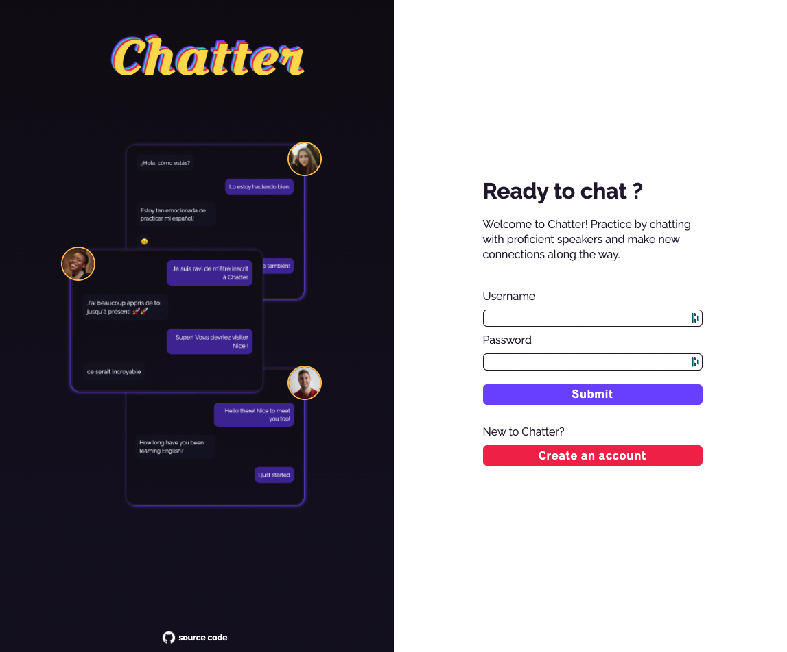

# Chatter

<a href='https://project-4-react.herokuapp.com/' target='blank'>Come chat here!</a>

 

[About](#about)
 
[How to Use Chatter](#how-to-use-chatter)
 
[Tech Stack](#tech-stack)
 
[Development](#development)
 
[Credits](#credits)
 
[Suggestions](#suggestions)
 
[Contributors](#contributors)

# About

Learning a new language? What better way to practice than to chat live with fluent speakers? Meet Chatter (WIP), a quick way to connect with fluent speakers through text. Learning a new language is hard, and learning how to speak conversationally can be even harder. Practice and hone your skills with Chatter and make new connections along the way.

> To see the source code for our backend checkout out [this repository](https://github.com/filipeqm94/server-project-4)

# How to Use Chatter

# Tech Stack

# Development

# Credits

# Suggestions

# Contributors

- [Filipe Marques](https://github.com/filipeqm94)
- [Victor Wang](https://github.com/v-wang)
